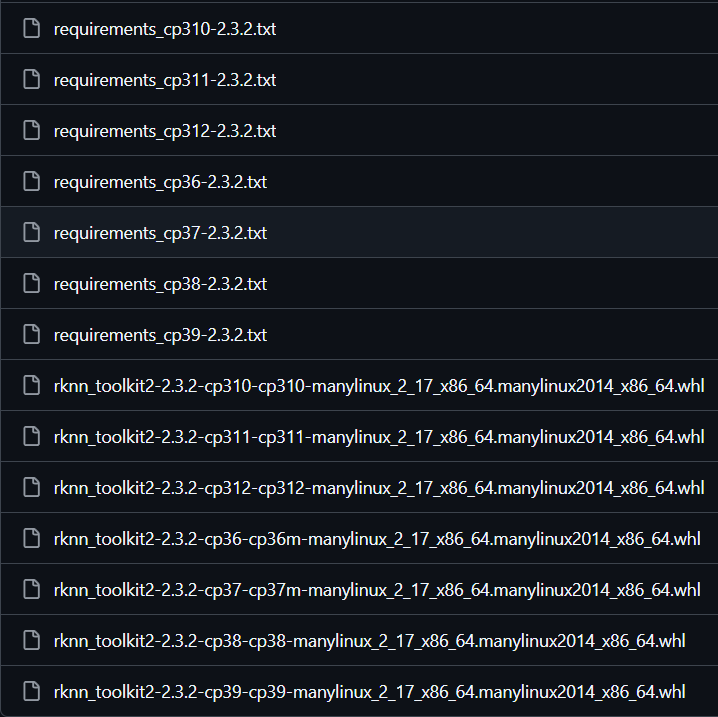
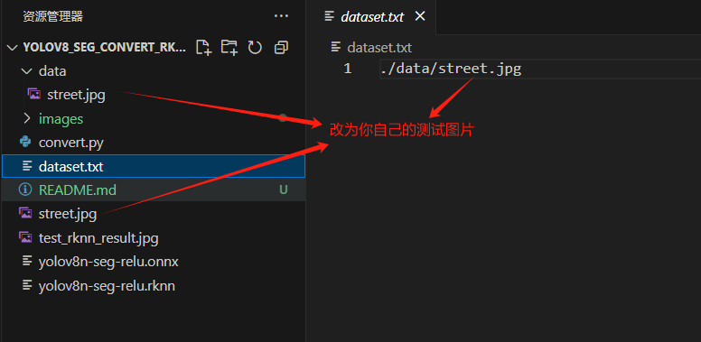
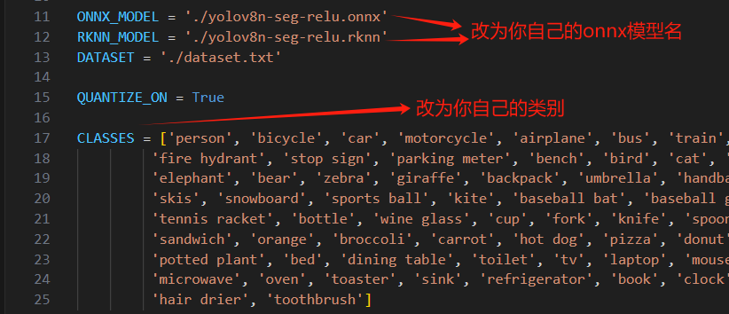
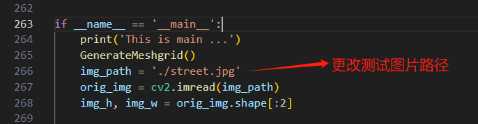
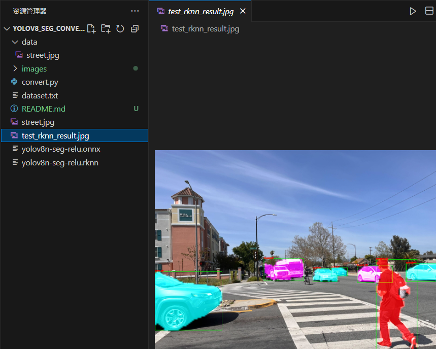

# yolov8-seg模型转换工具使用说明(onnx->rknn)

**注：此转换工具需配合仓库中的rk-yolov8([rokkieluo/rk-yolov8](https://github.com/rokkieluo/rk-yolov8))使用，操作系统为ubuntu**

## 一、环境依赖搭建：

进入rk官方github([rknn-toolkit2/rknn-toolkit2/packages/x86_64 at master · airockchip/rknn-toolkit2](https://github.com/airockchip/rknn-toolkit2/tree/master/rknn-toolkit2/packages/x86_64))，下载rknntoolkit2的python包，选择符合自己Python版本的即可，创建虚拟环境也可以



**注：此处需先安装requirements.txt的依赖环境后才可安装rknntoolkit2-whl**

搭建好依赖后后续操作才能正常实现

## 二、拉取本工具到本地

创建一个文件夹，进行拉取

```bash
git clone https://github.com/rokkieluo/yolov8_seg_convert_rknn.git
```

## 三、更换自己的测试图片和onnx模型

1.将自己的测试图片放入yolov8_seg_convert_rknn目录和data目录下，并更改dataset.txt的内容



2.将经过rk-yolov8转换后的onnx模型放入yolov8_seg_convert_rknn目录下

## 四、更改convert.py

1.在convert.py做如下修改



QUANTIZE_ON为量化选项，根据自己的情况来决定是否量化，一般建议量化提升速度

2.更改测试图片路径



## 五、终端运行convert.py

```python
python convert.py
```

运行后即可得到rknn模型，还会生成一个仿真检测图(test_rknn_result.jpg)，用于判断转换的模型有无问题，无问题则如图，至此转换rknn模型成功



